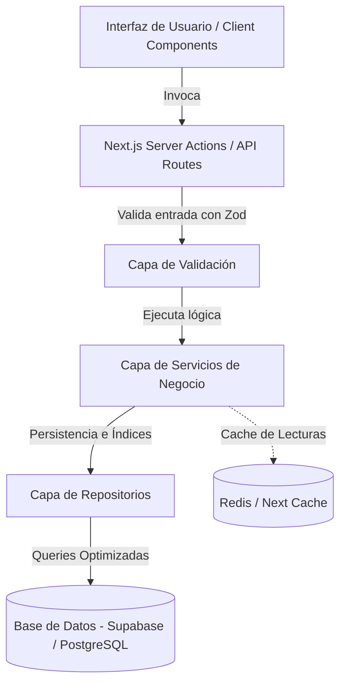

# Análisis de Mejora de Arquitectura y Dominio de Datos: Brofy

**Fecha:** 2026-06-03
**Estado:** Propuesta de Diseño (Preparado para escalabilidad)

Este documento presenta una propuesta detallada y optimizada para reestructurar la arquitectura del software, optimizar el dominio de datos (modelos de base de datos) y permitir tanto la **internacionalización progresiva (i18n)** como la **masificación y escalabilidad de datos** en la plataforma Brofy. Todo esto manteniendo intacta la lógica de negocio actual.

---

## 1. Arquitectura de Software Propuesta

Actualmente, gran parte de la lógica de persistencia, validaciones y reglas de negocio se encuentra concentrada directamente en `lib/actions.ts`. Para lograr la masificación de datos y facilitar la mantenibilidad, se sugiere desacoplar la lógica en capas claras mediante el patrón **Service-Repository** combinado con **Server Actions** como controladores de entrada.

### Diagrama de Capas de la Nueva Arquitectura


### Beneficios del Desacoplamiento
1. **Mantenibilidad:** La lógica para calcular comisiones, verificar la validez de un CMVP o gestionar el OTP de citas se aísla de la base de datos física.
2. **Optimización de Consultas:** Los repositorios pueden implementar estrategias de caché (como `cache()` de React o Redis) sin que la capa de interfaz se entere.
3. **Internacionalización flexible:** La capa de servicio puede interceptar los datos retornados por el repositorio y mapear los campos traducidos de acuerdo al locale actual.

---

## 2. Optimización del Dominio de Datos (Base de Datos)

El archivo `prisma/schema.prisma` tiene una estructura sólida para un MVP, pero presenta cuellos de botella importantes para la masificación y escalabilidad.

### A. Eliminación de Cadenas JSON No Estructuradas
Actualmente se guardan campos estructurados como cadenas de texto simples (`String` con formato JSON):
- `Pet.medicalHistory` (campo de texto para guardar arreglos de historial médico).
- `Establishment.operatingHours`, `Establishment.blockedDates`, y `Establishment.specialists`.

> [!WARNING]
> Guardar JSON stringificados en columnas `String` impide realizar filtros eficientes en la base de datos (e.g. buscar establecimientos disponibles en un horario específico requiere descargar todo el JSON y parsearlo en la app).

#### Propuesta de Normalización
1. **Horarios de Atención e Inasistencias:** Crear tablas dedicadas indexadas para realizar cruces rápidos de disponibilidad en búsquedas masivas.
2. **Especialistas:** Normalizar en una relación de muchos a muchos o tabla intermedia para optimizar las consultas de búsquedas por especialista.
3. **Historial Médico:** Utilizar la tabla `MedicalRecord` como la única fuente de verdad y eliminar la columna `medicalHistory` del modelo `Pet`.

### B. Añadir Índices en Base de Datos (Indispensable para Masificación)
Para evitar "Table Scans" y caídas de rendimiento a medida que los datos crecen en millones de filas, se deben agregar los siguientes índices en `schema.prisma`:

```prisma
// Ejemplo de Índices sugeridos en schema.prisma

model Profile {
  // ...
  @@index([role, isActive])
  @@index([email])
}

model Establishment {
  // ...
  @@index([ownerId])
  @@index([country, city, isActive]) // Búsqueda geográfica/regional rápida
}

model Appointment {
  // ...
  @@index([clientId])
  @@index([establishmentId])
  @@index([status, scheduledAt]) // Optimiza la vista de citas activas e históricas
}

model Transaction {
  // ...
  @@index([profileId, date])
}

model Reminder {
  // ...
  @@index([clientId, dueDate, isCompleted])
}
```

### C. Soporte Geoespacial Nativo (PostGIS)
Actualmente `latitude` y `longitude` se guardan como `Float` planos y se emulan cálculos matemáticos en memoria.
* **Solución de Escalabilidad:** Activar la extensión **PostGIS** en PostgreSQL (Supabase) y usar consultas SQL nativas (`prisma.$queryRaw`) con `ST_DWithin` y `ST_Distance` para buscar veterinarias cercanas en milisegundos, aprovechando los índices espaciales (`GIST`).

---

## 3. Internacionalización Progresiva (i18n)

Para internacionalizar progresivamente sin reestructurar todo el directorio del proyecto (que requeriría mover todo a `app/[locale]`), se plantea un enfoque híbrido: **Traducciones estáticas y Traducciones dinámicas**.

### A. Traducciones Estáticas (Interfaz de Usuario)
Utilizaremos un **Contexto de Traducción** del lado del cliente y del servidor ligero, configurable mediante Cookies o encabezados `Accept-Language` detectados en el `middleware.ts`.

#### Paso 1: Diccionarios de Traducción
Crear archivos JSON estructurados para los idiomas de soporte (e.g. `locales/es.json`, `locales/en.json`).

#### Paso 2: Middleware para Detección de Idioma
El middleware actual de autenticación puede interceptar la cookie de preferencia de idioma (`NEXT_LOCALE`) o el encabezado del navegador, inyectándolo en los headers del request para que los Server Components puedan leerlo de inmediato.

```typescript
// En middleware.ts
const locale = request.cookies.get('NEXT_LOCALE')?.value || 'es'
const response = NextResponse.next()
response.headers.set('x-locale', locale)
return response
```

#### Paso 3: Hook de Traducción Progresiva
Crear un hook cliente/servidor para leer las claves y traducirlas con fallback al español si no existe la traducción, permitiendo migrar componente por componente de manera progresiva.

### B. Traducciones Dinámicas (Base de Datos)
Para traducir datos ingresados por administradores o proveedores (como categorías de servicios, nombres de servicios genéricos o descripciones de locales):

#### Enfoque Recomendado: Columnas JSONB en PostgreSQL
En lugar de crear complejas tablas de traducción hijas para cada entidad, se aprovecha el poder de `JSONB` en PostgreSQL.

```prisma
model Service {
  id              String   @id @default(uuid())
  establishmentId String   @map("establishment_id")
  name            Json     // Almacena: { "es": "Baño medicado", "en": "Medicated bath" }
  description     Json?    // Almacena: { "es": "...", "en": "..." }
  price           Float
  // ...
}
```
* **En el código:** Se crea un Helper de dominio:
  ```typescript
  export function getLocalizedField(fieldVal: any, locale: string, fallback = 'es'): string {
      if (!fieldVal) return ''
      if (typeof fieldVal === 'string') return fieldVal // Retrocompatibilidad progresiva
      return fieldVal[locale] || fieldVal[fallback] || ''
  }
  ```
  Esto permite que la base de datos guarde las traducciones sin alterar las relaciones del esquema y de forma progresiva (las columnas de tipo string actuales se transforman a JSON dinámicamente).

---

## 4. Masificación de Datos (Carga Masiva y Escalabilidad)

Cuando Brofy escale a múltiples países y miles de transacciones diarias, la base de datos PostgreSQL debe configurarse de la siguiente manera:

### A. Transacciones de Carga Masiva (Bulk Import)
Para que los nuevos proveedores importen su lista de clientes, mascotas e historial desde otras plataformas de forma instantánea:
* Utilizar `prisma.$transaction` con inserciones por lotes (`createMany`).
* Configurar buffers de inserción y encolar cargas muy pesadas a través de Background Tasks (como Supabase Edge Functions o colas de trabajo como BullMQ en Node.js) para evitar sobrecargar el hilo principal de renderizado de Next.js.

### B. Conexión de Base de Datos y Pooling
* Para soportar miles de conexiones simultáneas desde las Serverless Functions de Next.js sin agotar los límites de la base de datos en Supabase, se debe integrar **Supabase Connection Pooling** (usando la URL del puerto del pooler `6543` en la variable de entorno `DATABASE_URL` con modo de transacción).
* Separar lecturas y escrituras: Dirigir consultas de solo lectura (`findMany` para discover, etc.) a réplicas de lectura de Supabase, manteniendo la base de datos primaria solo para escrituras (creación de citas, pagos).

### C. Estrategia de Archivo y Particionamiento
* La tabla `Appointment` y `Transaction` crecerán exponencialmente.
* **Estrategia:** Implementar particionamiento lógico de tablas en PostgreSQL por año o estado. Las citas de más de 1 año de antigüedad terminadas se pueden mover automáticamente a una tabla histórica o almacenarse en frío (Cold Storage), optimizando el tamaño activo de los índices.

---

## 5. Resumen del Plan de Implementación Progresiva

| Fase | Tarea Principal | Impacto de Riesgo | Beneficio Principal |
| :--- | :--- | :--- | :--- |
| **Fase 1** | **Indexación y Tipado de Base de Datos:** Agregar índices en `schema.prisma` y tipar campos JSON stringificados. | Bajo (Seguro) | Aceleración de consultas de inmediato y preparación para masificación. |
| **Fase 2** | **Capa de Abstracción de Datos:** Separar `lib/actions.ts` en servicios enfocados con Zod schemas. | Medio (Refactor) | Código limpio, testeable y preparado para traducciones en memoria. |
| **Fase 3** | **Internacionalización Progresiva UI:** Configurar diccionarios locales y lector de cookie/header. | Bajo (Seguro) | Permite traducir partes de la UI sin cambiar la estructura del router. |
| **Fase 4** | **i18n de Datos y Escalabilidad de Infraestructura:** Implementar soporte JSONB en modelos base y configurar connection pool. | Medio (Migración) | Soporte internacional de catálogos y resiliencia ante picos de tráfico masivo. |
