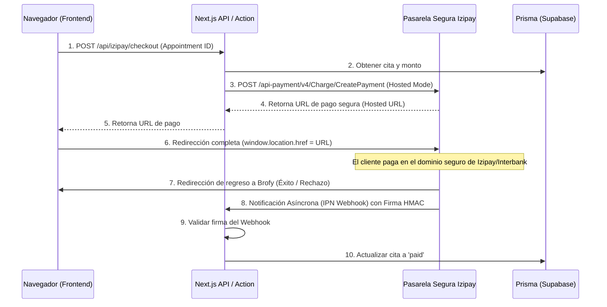

# Guía de Integración de Izipay (Redirección / Hosted Checkout)

**Fecha:** 2026-06-03
**Estado:** Guía de Integración Aprobada

Esta guía detalla cómo integrar la pasarela de pagos de **Izipay (Interbank / Lyra)** mediante el flujo de **Redirección**. En este modo, el usuario es redirigido completamente a los servidores seguros de Izipay para ingresar sus datos bancarios, garantizando que **nuestra plataforma nunca toque, procese o almacene datos de tarjetas**.

---

## Flujo de Redirección (Hosted Payment Page)



---

## 1. Configuración de Variables de Entorno

Asegúrate de agregar estas variables en tu archivo [`.env`](file:///Users/luisl/Desktop/Apps/Brofy%20copia/.env):

```bash
# Credenciales de Izipay
IZIPAY_MERCHANT_ID="tu_codigo_de_comercio"
IZIPAY_API_PASSWORD="tu_clave_de_api_password"
IZIPAY_SHA256_KEY="tu_llave_HMAC_SHA256_para_webhooks"

# Dominio de la pasarela
NEXT_PUBLIC_IZIPAY_API_URL="https://api.izipay.pe"
```

---

## 2. API Backend: Generar URL de Redirección (Next.js V4 API)

Crea el archivo [**`app/api/izipay/checkout/route.ts`**](file:///Users/luisl/Desktop/Apps/Brofy%20copia/app/api/izipay/checkout/route.ts). Este endpoint solicita la orden de pago configurada en modo redirección:

```typescript
import { NextResponse } from 'next/server'
import prisma from '@/lib/prisma'

export async function POST(request: Request) {
    try {
        const { appointmentId } = await request.json()

        // 1. Obtener los detalles de la cita
        const appointment = await prisma.appointment.findUnique({
            where: { id: appointmentId },
            include: { client: true }
        })

        if (!appointment) {
            return NextResponse.json({ error: 'Cita no encontrada' }, { status: 404 })
        }

        // Monto en centavos (ejemplo: S/ 50.00 -> 5000)
        const amountInCents = Math.round(appointment.commissionAmount * 100)

        // 2. Credenciales Basic Auth
        const username = process.env.IZIPAY_MERCHANT_ID
        const password = process.env.IZIPAY_API_PASSWORD
        const authHeader = 'Basic ' + Buffer.from(`${username}:${password}`).toString('base64')

        // 3. Solicitar URL de Redirección a Izipay (Lyra V4 API)
        const response = await fetch(`${process.env.NEXT_PUBLIC_IZIPAY_API_URL}/api-payment/v4/Charge/CreatePayment`, {
            method: 'POST',
            headers: {
                'Authorization': authHeader,
                'Content-Type': 'application/json'
            },
            body: JSON.stringify({
                amount: amountInCents,
                currency: appointment.currency || 'PEN',
                orderId: appointment.id,
                // Configuramos para redireccionar al Hosted Payment Page
                paymentMethodType: "IPG_HOSTED", 
                customer: {
                    email: appointment.client.email
                },
                // Rutas de retorno una vez que finalice el pago en Izipay
                redirectionParameters: {
                    successUrl: `${process.env.NEXT_PUBLIC_APP_URL || 'http://localhost:3000'}/dashboard/client/pending?status=success`,
                    cancelUrl: `${process.env.NEXT_PUBLIC_APP_URL || 'http://localhost:3000'}/dashboard/client/pending?status=cancel`
                }
            })
        })

        const data = await response.json()

        if (data.status !== 'SUCCESS') {
            return NextResponse.json({ error: 'Error al generar la pasarela de pagos', details: data }, { status: 400 })
        }

        // Retornamos la URL de redirección provista por Izipay
        // En el formato V4 REST, la URL de redirección viene dentro del answer
        const redirectUrl = data.answer.redirectUrl

        return NextResponse.json({ redirectUrl })

    } catch (error: any) {
        console.error('Error Izipay Redirect Checkout:', error)
        return NextResponse.json({ error: error.message || 'Internal Server Error' }, { status: 500 })
    }
}
```

---

## 3. Frontend: Botón de Pago con Redirección

En tu frontend, no necesitas incrustar ningún formulario ni script de Izipay. Solo necesitas un botón que llame a tu API y redirija al usuario:

```tsx
'use client'

import { useState } from 'react'

interface PayButtonProps {
    appointmentId: string
}

export function IzipayRedirectButton({ appointmentId }: PayButtonProps) {
    const [loading, setLoading] = useState(false)
    const [error, setError] = useState<string | null>(null)

    const handlePayment = async () => {
        setLoading(true)
        setError(null)
        try {
            const res = await fetch('/api/izipay/checkout', {
                method: 'POST',
                headers: { 'Content-Type': 'application/json' },
                body: JSON.stringify({ appointmentId })
            })

            const data = await res.json()

            if (data.redirectUrl) {
                // REDIRECCIÓN COMPLETA A IZIPAY
                window.location.href = data.redirectUrl
            } else {
                setError(data.error || 'Error al obtener la URL de pago')
            }
        } catch (err) {
            setError('Ocurrió un error al procesar la solicitud.')
        } finally {
            setLoading(false)
        }
    }

    return (
        <div className="flex flex-col items-center gap-2">
            <button
                onClick={handlePayment}
                disabled={loading}
                className="bg-[#078EAD] hover:bg-[#067c97] text-white font-bold py-3 px-6 rounded-xl transition-all shadow-md active:scale-95 disabled:opacity-50"
            >
                {loading ? 'Redirigiendo a pasarela segura...' : 'Pagar con Izipay'}
            </button>
            {error && <p className="text-red-500 text-xs mt-1">{error}</p>}
        </div>
    )
}
```

---

## 4. Webhook Backend: Confirmación del Pago (IPN)

Izipay notificará a tu servidor de forma asíncrona mediante un POST con firma digital. Crea el archivo [**`app/api/izipay/webhook/route.ts`**](file:///Users/luisl/Desktop/Apps/Brofy%20copia/app/api/izipay/webhook/route.ts):

```typescript
import { NextResponse } from 'next/server'
import crypto from 'crypto'
import prisma from '@/lib/prisma'

function verifyHash(krAnswer: string, receivedHash: string, key: string): boolean {
    const calculatedHash = crypto
        .createHmac('sha256', key)
        .update(krAnswer)
        .digest('hex')
    return calculatedHash === receivedHash
}

export async function POST(request: Request) {
    try {
        const formData = await request.formData()
        const krAnswer = formData.get('kr-answer') as string
        const krHash = formData.get('kr-hash') as string

        if (!krAnswer || !krHash) {
            return NextResponse.json({ error: 'Firma faltante' }, { status: 400 })
        }

        // Validar firma usando la clave SHA256 configurada en el panel
        const isValid = verifyHash(krAnswer, krHash, process.env.IZIPAY_SHA256_KEY || '')

        if (!isValid) {
            return NextResponse.json({ error: 'Firma inválida' }, { status: 401 })
        }

        const paymentData = JSON.parse(krAnswer)
        const orderStatus = paymentData.orderStatus // 'PAID'
        const orderId = paymentData.orderDetails.orderId // ID de la cita en Brofy
        const transactionId = paymentData.transactions[0]?.uuid

        if (orderStatus === 'PAID') {
            // Actualizar estado de la cita en Prisma
            await prisma.appointment.update({
                where: { id: orderId },
                data: {
                    status: 'paid',
                    paymentId: transactionId,
                }
            })
            console.log(`Pago verificado para cita ${orderId}`)
        }

        return new Response('OK', { status: 200 })
    } catch (error: any) {
        return NextResponse.json({ error: error.message }, { status: 500 })
    }
}
```
