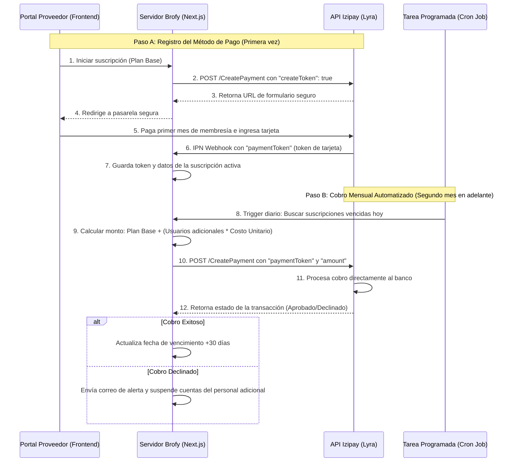

# Arquitectura Multiusuario y Modelo de Suscripción Recurrente con Izipay

**Fecha:** 2026-06-16
**Estado:** Propuesta de Diseño Aprobada por el Usuario (Listo para implementación futura)

Esta propuesta técnica detalla cómo estructurar la base de datos para admitir operadores (personal) con roles y permisos específicos bajo un establecimiento, y cómo implementar el cobro de suscripciones mensuales fijas + cargos por usuarios adicionales utilizando la pasarela **Izipay**.

> [!IMPORTANT]
> **Clarificación de Modelos de Cobro en Paralelo:**
> *   **Para Proveedores (SaaS):** Este modelo de suscripción mensual es exclusivo para los proveedores que deseen delegar y organizar su personal mediante múltiples accesos.
> *   **Para Clientes (Acceso a Plataforma):** El cobro transaccional de **S/ 5.00** por reserva/acceso de cliente sigue funcionando con total normalidad de forma paralela.

---

## 1. Diseño de Base de Datos Multiusuario (RBAC)

Para permitir que un establecimiento tenga operadores con acceso limitado, debemos migrar de la relación directa actual (*"un local pertenece a un único perfil de dueño"*) a un modelo de control de acceso basado en roles (**RBAC - Role-Based Access Control**).

### Nuevos Modelos en Prisma

Proponemos añadir el modelo `EstablishmentMember` y el enum `MemberRole`. Esto permite invitar a otros usuarios (registrados con su propio email y contraseña) a colaborar en un local.

```prisma
// prisma/schema.prisma

enum MemberRole {
  OWNER         // Dueño: control total, facturación, suscripciones
  ADMIN         // Administrador: gestiona agendas, servicios y personal
  VET           // Veterinario: atiende citas, edita fichas médicas (requiere CMVP)
  STYLIST       // Estilista/Paseador/Adiestrador: ve detalles de citas asignadas y comportamiento
  RECEPTIONIST  // Recepcionista: agenda citas y valida códigos, no edita fichas médicas
}

model EstablishmentMember {
  id              String         @id @default(uuid())
  establishmentId String         @map("establishment_id")
  profileId       String         @map("profile_id")
  role            MemberRole     @default(VET)
  isActive        Boolean        @default(true) @map("is_active")
  createdAt       DateTime       @default(now()) @map("created_at")
  updatedAt       DateTime       @updatedAt @map("updated_at")

  // Relaciones
  establishment   Establishment  @relation(fields: [establishmentId], references: [id], onDelete: Cascade)
  profile         Profile        @relation(fields: [profileId], references: [id], onDelete: Cascade)

  @@unique([establishmentId, profileId]) // Un usuario solo tiene un rol por establecimiento
  @@map("establishment_members")
  @@index([profileId])
}
```

### Tabla de Permisos por Rol

| Permiso / Capacidad | OWNER | ADMIN | VET | STYLIST | RECEPTIONIST |
| :--- | :---: | :---: | :---: | :---: | :---: |
| Modificar suscripción / método de pago | ✅ | ❌ | ❌ | ❌ | ❌ |
| Agregar/dar de baja personal | ✅ | ✅ | ❌ | ❌ | ❌ |
| Ver reportes financieros de ganancias | ✅ | ✅ | ❌ | ❌ | ❌ |
| Crear y modificar tarifas/servicios | ✅ | ✅ | ❌ | ❌ | ❌ |
| Validar códigos de atención (checkin) | ✅ | ✅ | ✅ | ✅ | ✅ |
| Editar fichas médicas e historial digital | ✅ | ❌ | ✅ | ❌ | ❌ |
| Ver historial de citas del local | ✅ | ✅ | ✅ | ✅ | ✅ |

### Flujo de Invitación de Personal
1. El **Dueño** ingresa el correo del empleado en su panel de configuración.
2. Si el empleado ya tiene cuenta en Brofy, se añade directamente como `EstablishmentMember`. Si no, se le envía una invitación por correo para registrarse e incorporarse automáticamente con el rol asignado.

---

## 2. Modelo de Suscripción Recurrente con Izipay

Sí, **es totalmente posible implementar un modelo de suscripción recurrente con Izipay**. Para lograr esto sin obligar al usuario a pagar manualmente cada mes, se utiliza el flujo de **Tokenización de Tarjetas (Card-on-File)** a través de la API REST V4 de Lyra/Izipay.

### Flujo Técnico de Cobro Recurrente



### Detalle de la API de Izipay para Cobros Automáticos (Backend)

Una vez que guardas el `paymentToken` (por ejemplo: `tok_abc123xyz...`), las facturaciones mensuales subsecuentes se realizan de servidor a servidor **sin intervención del usuario**:

```typescript
// Ejemplo de cobro periódico automático desde el backend
const response = await fetch("https://api.izipay.pe/api-payment/v4/Charge/CreatePayment", {
    method: "POST",
    headers: {
        "Authorization": authHeader,
        "Content-Type": "application/json"
    },
    body: JSON.stringify({
        amount: calculatedAmountInCents, // Monto dinámico según cantidad de operadores
        currency: "PEN",
        orderId: `invoice_${subscriptionId}_${new Date().getTime()}`,
        paymentMethodType: "CARD",
        paymentToken: savedCardToken, // El token guardado en el Paso A
        customer: {
            email: providerEmail
        }
    })
});
const data = await response.json();
```

---

## 3. Modelo de Negocio Modular y Facturación Dinámica

### Filosofía de Modularidad (No Exclusión)
El modelo de suscripción multiusuario está diseñado como una **mejora administrativa y organizativa premium**, sin limitar la funcionalidad esencial de la plataforma:
1.  **Sin Suscripción (Acceso por Defecto / Cuenta Compartida):**
    *   Cualquier proveedor puede realizar el 100% de las operaciones (crear servicios, agendas, validar códigos de citas de clientes, y actualizar fichas médicas) de manera gratuita a través de la cuenta principal del establecimiento.
2.  **Con Suscripción (Acceso Multi-operador Independiente):**
    *   Permite a los miembros de su equipo (paseadores, veterinarios, estilistas, recepcionistas) iniciar sesión con su **propio usuario y contraseña** de manera independiente.
    *   Otorga reportes detallados de qué operador atendió cada cita y segmentación de permisos según el puesto de trabajo.

### Estructura de Precios (Ejemplo Referencial)
*(Los precios finales son referenciales y se adaptarán para ser sumamente accesibles en el mercado)*

*   **Plan Base**: `S/ X.00 al mes`. Incluye la cuenta del Dueño (Owner) + 1 operador independiente.
*   **Costo por Operador Adicional**: `S/ Y.00 al mes` por cada miembro de personal activo extra.

### Lógica de Control de Suscripción en Prisma

```prisma
model Subscription {
  id              String         @id @default(uuid())
  establishmentId String         @unique @map("establishment_id")
  status          String         @default("active")  // 'active', 'past_due', 'canceled'
  cardToken       String?        @map("card_token")  // Tokenizado por Izipay para cobro automático
  cardBrand       String?        @map("card_brand")  // Visa, Mastercard, etc.
  cardLast4       String?        @map("card_last4")
  nextBillingDate DateTime       @map("next_billing_date")
  createdAt       DateTime       @default(now()) @map("created_at")

  establishment   Establishment  @relation(fields: [establishmentId], references: [id], onDelete: Cascade)
}
```

### Cálculo Dinámico del Monto de Cobro (Cron Job)
Cada mes, al dispararse el cron para facturar al local:
1. Obtenemos el total de operadores activos:
   `const activeStaffCount = await prisma.establishmentMember.count({ where: { establishmentId, isActive: true } })`
2. El primer operador está incluido en el plan base. Si hay más, se calcula el excedente:
   `const extraStaff = Math.max(0, activeStaffCount - 1);`
3. Monto final:
   `const totalPennies = (BASE_PRICE + (extraStaff * EXTRA_USER_PRICE)) * 100;`
4. Se ejecuta la llamada de backend a Izipay con el `cardToken` guardado. En caso de impago, el local vuelve a la cuenta compartida por defecto (sin perder datos de atenciones pasadas).
